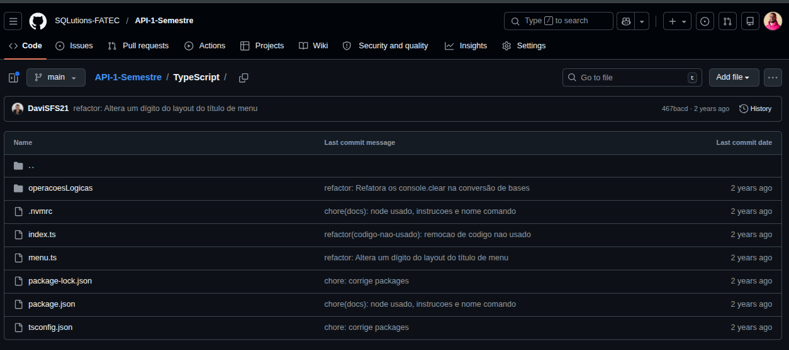
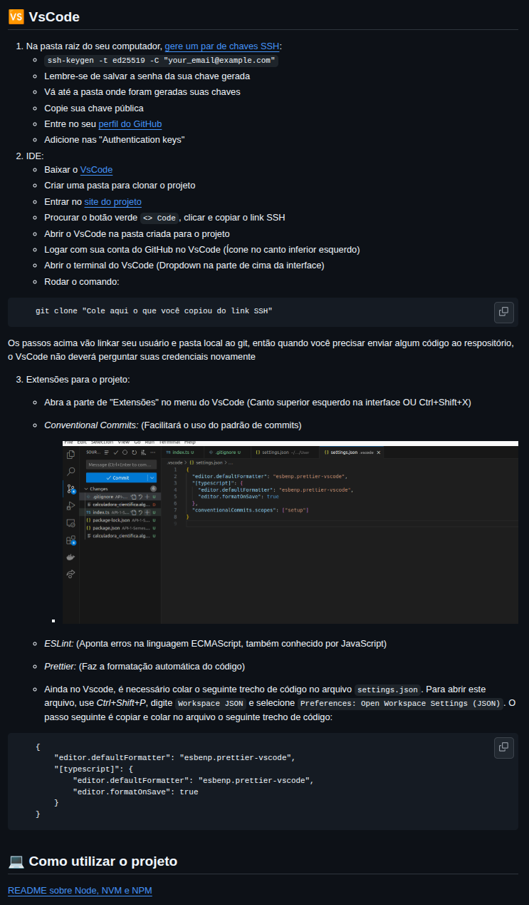
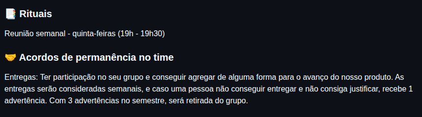
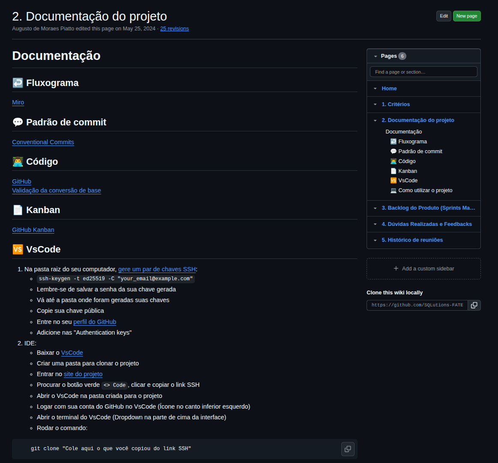
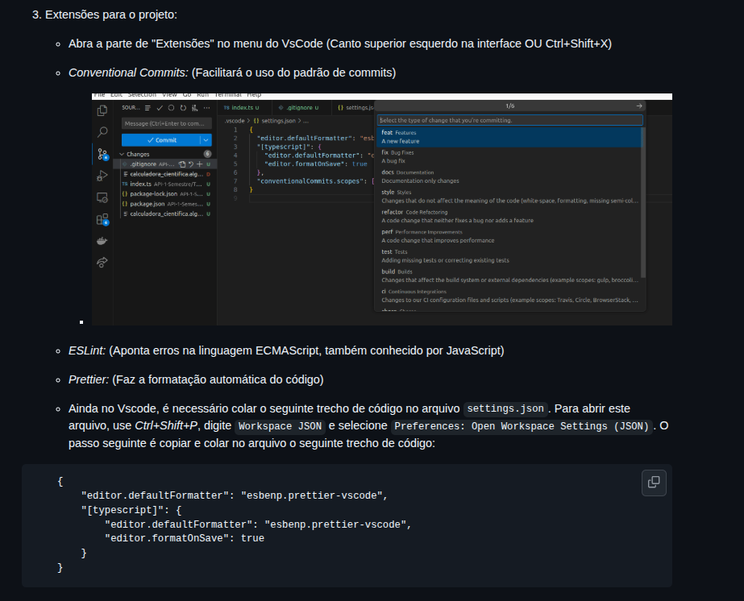

PENDENTE: VÍDEOS DO FUNCIONAMENTO

<h1 align="center">🚀 API 1º Semestre - 01/2024</h1>

  

  🎓 <strong>Parceiro Acadêmico:</strong> 
  FATEC São José dos Campos - Prof. Jessen Vidal

---

## 📌 Resumo do Projeto

> Desenvolvimento de uma Calculadora Científica capaz de realizar operações matemáticas básicas e avançadas, com foco em precisão dos resultados e facilidade de uso, auxiliando usuários em cálculos do dia a dia de forma eficiente.

---

## ⚠️ Problema

> Necessidade de uma ferramenta simples e confiável para realização de cálculos matemáticos e financeiros, garantindo precisão e facilidade de utilização.

---

## 💡 Solução

> Desenvolvimento de uma calculadora científica com interface interativa baseada em menu, capaz de executar operações matemáticas e financeiras, com validações que garantem a confiabilidade dos resultados.

---

## 🛠 Tecnologias Adotadas

  
  
  

- **VisualG (Portugol)**: Utilizado para desenvolvimento inicial da lógica da aplicação e implementação das operações da calculadora.  
- **TypeScript**: Utilizado na etapa final para adaptação do projeto, trazendo tipagem estática e melhor organização do código.  
- **Trello**: Ferramenta utilizada para organização das tarefas e acompanhamento do progresso do projeto.  

---

## 👨‍💻 Contribuições Individuais

Atuei como **Product Owner** no projeto, sendo responsável pela gestão do backlog, organização do time e documentação do processo. Também contribuí no desenvolvimento de funcionalidades da calculadora.

    
🖥️ Setup do Ambiente

     
    Fui responsável pela configuração inicial do ambiente de desenvolvimento, garantindo que todos os membros do time tivessem as ferramentas necessárias instaladas e funcionando corretamente para iniciar o projeto.
     
     
    

      
      
    

  

  

    
👥 Definição de Permanência no Time

     
    Estabeleci critérios e diretrizes para definição da permanência dos membros no time, garantindo o comprometimento e a continuidade das entregas ao longo do projeto.
     
     
    

      
    

  

  

    
👥 Separação de Grupos ou Duplas para Codar

     
    Organizei a divisão do time em grupos e duplas para desenvolvimento das funcionalidades, equilibrando as competências técnicas e promovendo a colaboração entre os membros.
     
  

  

    
📄 Documentação na Wiki

     
    Elaborei e mantive a documentação do projeto na wiki do repositório, registrando informações relevantes sobre o funcionamento do sistema, decisões técnicas e orientações para o time.
     
     
    

      
    

  

  

    
⚙️ Setup do VS Code

     
    Configurei o VS Code para padronizar o ambiente de desenvolvimento da equipe, incluindo extensões recomendadas, configurações de formatação e debug, facilitando o trabalho colaborativo.
     
     
    

      
    

  

  

    
🧮 Contribuição no Desenvolvimento da Calculadora

     
    Atuei como consultor técnico para os desenvolvedores e auxiliei na validação das entregas para garantir o alinhamento com os requisitos.
     
  

---

## ⚙️ Funcionamento

A aplicação funciona através de um menu interativo que permite ao usuário selecionar diferentes operações matemáticas e financeiras.

### 🧾 Interface de interação

O usuário interage com o sistema por meio de um menu, onde pode escolher a operação desejada de forma simples e objetiva.

> 💡 *Sugestão de imagem futura:* print da tela do menu da calculadora

---

### 🧮 Operações matemáticas

O sistema oferece suporte a diversas operações:

- ➕ Soma, subtração, multiplicação e divisão  
- 🔢 Fatorial  
- 📈 Função de segundo grau  

> 💡 *Sugestão de imagem futura:* exemplo de execução de cálculo

---

### 💰 Operações financeiras

Também foram implementadas funcionalidades voltadas a cálculos financeiros:

- 💵 Juros simples  
- 💸 Juros compostos  

> 💡 *Sugestão de imagem futura:* exemplo de cálculo de juros

---

### 🔄 Outras funcionalidades

- 🔢 Conversão de base numérica  
- 🔤 Concatenação de strings  
- 🔁 Conversão do projeto para TypeScript  

> 💡 *Sugestão de imagem futura:* exemplo de conversão ou saída do sistema

---

O fluxo da aplicação é baseado na escolha da operação, entrada de dados pelo usuário e exibição do resultado calculado, garantindo simplicidade e eficiência no uso.

---

## 📚 Aprendizados Efetivos

Neste projeto, desenvolvi minha base em lógica de programação, trabalhando com estruturas condicionais, repetição e organização de código. Também tive meu primeiro contato com tipagem utilizando TypeScript, além de aprender a estruturar melhor soluções para resolução de problemas.

Além disso, tive experiência com metodologia ágil, organização de tarefas e trabalho em equipe, entendendo como dividir atividades e acompanhar a evolução do projeto ao longo das sprints.

---

### 🧠 Hard Skills

<table align="center">
  <tr>
    <th width="270px">Tecnologia/Metodologia</th>
    <th width="85px">Nota</th>
    <th width="200px">Classificação</th>
  </tr>
  <tr>
    <td>Metodologia Ágil Scrum</td>
    <td>★★★☆☆</td>
    <td>Entendi</td>
  </tr>
  <tr>
    <td>VisualG</td>
    <td>★★★☆☆</td>
    <td>Entendi</td>
  </tr>
  <tr>
    <td>TypeScript</td>
    <td>★★★★☆</td>
    <td>Sei fazer com ajuda</td>
  </tr>
  <tr>
    <td>Git</td>
    <td>★★★★★</td>
    <td>Sei fazer com autonomia</td>
  </tr>
</table>

---

### 🤝 Soft Skills

<table align="center">
  <tr>
    <th width="270px">Habilidade</th>
    <th width="280px">Descrição</th>
  </tr>
  <tr>
    <td>Proatividade</td>
    <td>Busquei aprender novas ferramentas e conceitos necessários para o desenvolvimento do projeto.</td>
  </tr>
  <tr>
    <td>Aprendizado contínuo</td>
    <td>Desenvolvi conhecimentos em lógica de programação e metodologia ágil ao longo do projeto.</td>
  </tr>
  <tr>
    <td>Comunicação</td>
    <td>Colaborei com o time no alinhamento das tarefas e entendimento dos requisitos.</td>
  </tr>
  <tr>
    <td>Organização</td>
    <td>Participei da organização das tarefas e estruturação do projeto no GitHub.</td>
  </tr>
</table>

---

## 🔎 Navegação entre Projetos

- **1º Semestre: Calculadora Científica**  
- [2º Semestre: Projeto Avaliador de Soft Skill](https://github.com/augustopiatto/portfolio-fatec/blob/main/projetos/API-2-semestre.md)  
- [3º Semestre: Sistema de Ponto e Geração de Relatórios](https://github.com/augustopiatto/portfolio-fatec/blob/main/projetos/API-3-semestre.md)  
- [4º Semestre: Monitoramento e Resposta a Incidentes](https://github.com/augustopiatto/portfolio-fatec/blob/main/projetos/API-4-semestre.md)  
- [5º Semestre: TODO](https://github.com/augustopiatto/portfolio-fatec/blob/main/projetos/API-5-semestre.md)  
- [6º Semestre: TODO](https://github.com/augustopiatto/portfolio-fatec/blob/main/projetos/API-6-semestre.md)  

---

  ✨ Desenvolvido durante a graduação em Banco de Dados

