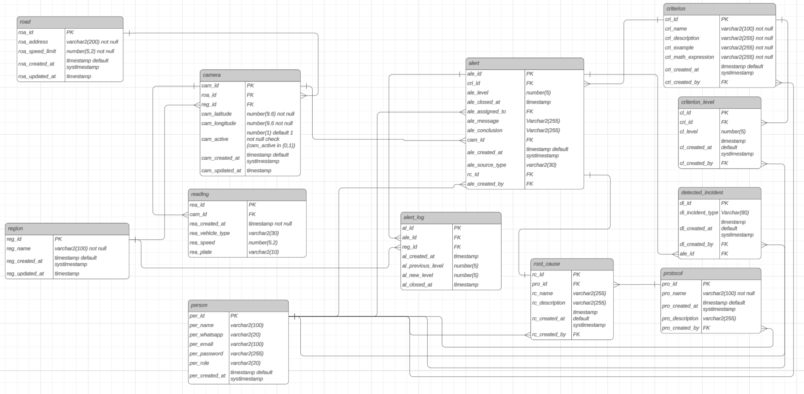
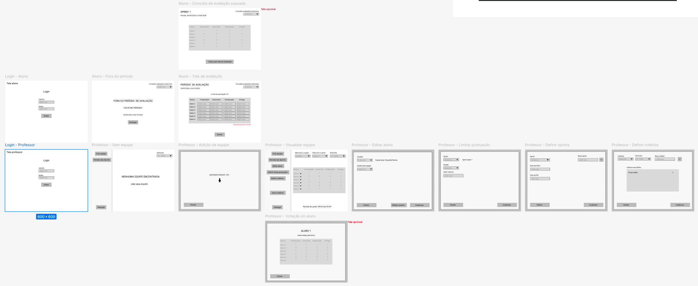
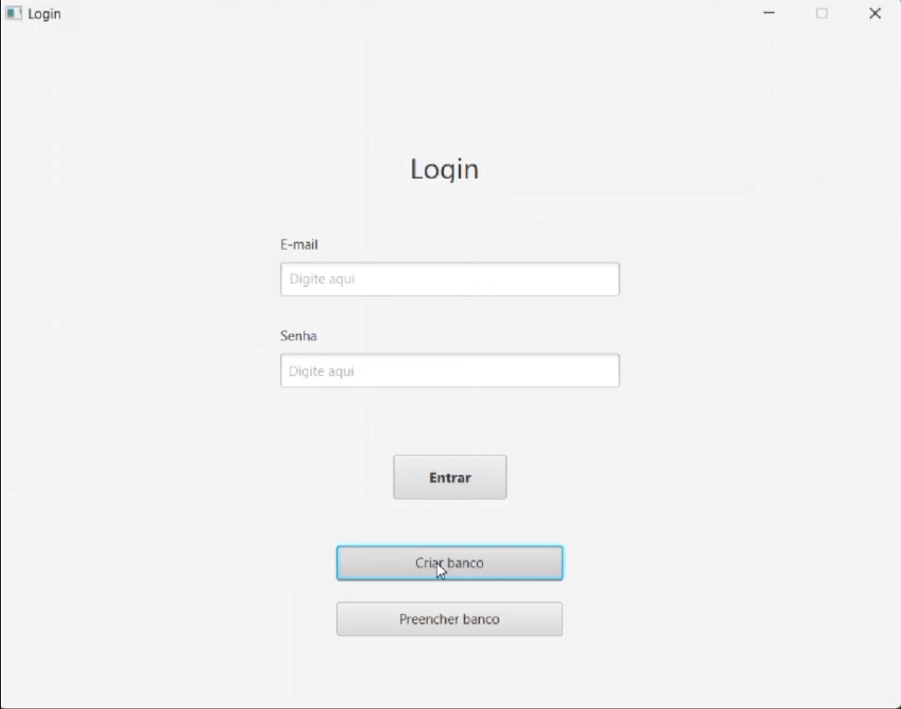

<h1 align="center">🚀 API 2º Semestre - 02/2024</h1>

  

  🎓 <strong>Parceiro Acadêmico:</strong> 
  FATEC São José dos Campos - Prof. Jessen Vidal

---

## 📌 Resumo do Projeto

> O objetivo deste projeto é o desenvolvimento de um Avaliador de Soft Skill. Anualmente, os professores responsáveis pela disciplina de API recebem dos alunos uma avaliação PACER (Proatividade, Autonomia, Colaboração e Entrega de Resultados), que os próprios membros dos grupos preenchem. No entanto, essas avaliações são feitas em formatos variados e, muitas vezes, sem o cálculo automático da média de cada aluno, o que consome um tempo significativo dos docentes.
> 
> Este sistema foi desenvolvido para permitir que alunos avaliem seus colegas de grupo, calcule automaticamente as médias das notas e entregue aos professores as informações em um formato padronizado. A solução também oferece permissões administrativas para que os professores possam gerenciar o sistema de forma eficiente, garantindo uma interface intuitiva e fluxos claros para todos os usuários.

---

## ⚠️ Problema

> A falta de uma ferramenta padronizada para a coleta e cálculo das avaliações de soft skills pelos alunos resultava em retrabalho manual para os professores, que precisavam consolidar diferentes formatos de planilhas e calcular as médias individualmente, consumindo um tempo precioso que poderia ser dedicado a outras atividades acadêmicas.

---

## 💡 Solução

> Desenvolvimento de uma aplicação desktop em Java com JavaFX que automatiza o processo de avaliação entre pares. A solução permite o cadastro em lote de alunos e equipes via arquivo CSV, estabelece períodos de avaliação para cada sprint, calcula automaticamente as médias por critério e por aluno, e possibilita a exportação de relatórios padronizados para os professores, garantindo transparência e eficiência no processo.

---

## 🛠 Tecnologias Adotadas

  
  
  
  
  
  
  

- **Java**: Linguagem principal utilizada no desenvolvimento do backend e da lógica de negócios da aplicação, aproveitando sua robustez e orientação a objetos para construir um sistema confiável.
- **JavaFX**: Framework utilizado para a construção da interface gráfica desktop, permitindo a criação de uma experiência de usuário rica, intuitiva e responsiva.
- **MySQL**: Sistema de gerenciamento de banco de dados relacional utilizado para armazenar todas as informações do sistema, como usuários, equipes, sprints, critérios de avaliação e notas.
- **Git/GitHub**: Ferramentas de versionamento utilizadas para controle de versão do código, colaboração em equipe e gerenciamento do repositório central do projeto.
- **Figma**: Ferramenta de design utilizada para a criação de wireframes e prototipação da interface, garantindo o alinhamento com o cliente antes do desenvolvimento.
- **IntelliJ IDEA**: Ambiente de Desenvolvimento Integrado (IDE) utilizado pela equipe para codificação, depuração e execução do projeto.

---

## 👨‍💻 Contribuições Individuais

Atuei como **desenvolvedor full-stack** em uma aplicação desktop, sendo responsável por contribuições que abrangeram desde a modelagem do banco de dados até a construção da interface gráfica e a lógica de negócios. Fui responsável pela implementação de funcionalidades críticas tanto no front-end (JavaFX) quanto no back-end (Java). Minhas contribuições garantiram o controle de acesso ao sistema, a parametrização das avaliações pelos professores e a consistência dos dados ao longo das sprints.

  
🗄️ <b>Modelagem e Gestão do Banco de Dados (MySQL)</b>

   
  Auxiliei o processo de modelagem do banco de dados relacional, garantindo que a estrutura suportasse de forma eficiente todos os requisitos do sistema, como o gerenciamento de múltiplas sprints, a flexibilidade de critérios de avaliação e o relacionamento entre alunos e equipes. As principais contribuições foram:
   
   
  

    
Diagrama Entidade-Relacionamento (DER)

     
    Auxiliei o processo de criação do DER do sistema, que serviu como guia para toda a implementação da camada de dados, assegurando a normalização e a integridade referencial entre as tabelas.
     
     
    

      
    

  

  
🎨 <b>Prototipação e Validação de Interface (Figma)</b>

   
  Como parte do processo de alinhamento com o cliente (professores), criei wireframes detalhados de todas as telas do sistema no Figma. Esta etapa foi crucial para validar os fluxos de usuário (aluno e professor), coletar feedback antecipado e garantir que a experiência do usuário fosse intuitiva antes mesmo do início da codificação.
   
   
  

    
  

  
💻 <b>Desenvolvimento Front-end (JavaFX)</b>

   
  No front-end, fui responsável pela implementação de telas e fluxos essenciais para a experiência dos usuários (alunos e professores), garantindo uma interface intuitiva e responsiva.
   
   
  

    
🔐 Tela de Login

     
    Implementei a interface de autenticação, integrando-a com o back-end para validação de credenciais e redirecionamento baseado no perfil do usuário (aluno ou professor).
     
     
    

      
    

  

  

    
📅 Definição do Período de Avaliação

     
    Desenvolvi a tela onde o professor configura as datas de início e fim para cada sprint, com validações e feedbacks claros.
     
     
    

      
    

  

  

    
📋 Definição de Critérios do Semestre

     
    Criei a interface para o professor cadastrar e editar os critérios de avaliação (ex: Proatividade, Autonomia) que serão utilizados em um determinado semestre.
     
     
    

      
    

  

  

    
📊 Visualização das Médias da Equipe

     
    Implementei a tela que exibe as médias calculadas de cada aluno por equipe e sprint, permitindo que o professor acompanhe o desempenho de forma clara e organizada.
     
     
    

      
    

  

  

    
🛠️ Refactors e Fixes Menores

     
    Realizei melhorias contínuas na interface e correções de bugs ao longo do projeto, assegurando a qualidade e a usabilidade do sistema.
     
     
    

      
    

  

  
⚙️ <b>Lógica de Negócios e Back-end (Java)</b>

   
  No back-end, atuei na construção das regras de negócio e na exposição de endpoints para suportar as funcionalidades gerenciadas pelos professores.
   
   
  

    
🔐 Autenticação (Login)

     
    Implementei a lógica de validação de credenciais no back-end, com verificação no banco de dados e retorno do perfil do usuário autenticado.
     
  

  

    
📅 Definição do Período de Avaliação

     
    Desenvolvi os endpoints e a lógica para persistir as datas de início e fim das sprints, além das validações para garantir que apenas professores autorizados possam realizar essa configuração.
     
  

  

    
📋 Definição de Critérios do Semestre

     
    Criei a camada de serviço e os endpoints para o cadastro, edição e remoção dos critérios de avaliação, assegurando a integridade referencial com as avaliações já realizadas.
     
  

  

    
🎯 Professor Definir Pontuação Máxima de Sprint

     
    Implementei a lógica que permite ao professor configurar o limite de pontos que cada aluno pode distribuir em uma sprint, persistindo essa informação e aplicando-a nas validações futuras.
     
  

  

    
✏️ Professor Editar Aluno

     
    Desenvolvi os endpoints para edição de dados cadastrais dos alunos, garantindo que apenas usuários com perfil de professor possam realizar essa operação.
     
  

  

    
🛠️ Refactors e Fixes Menores

     
    Realizei refatorações no código para melhorar a performance e a manutenibilidade, além de correções de bugs identificados durante os testes.
     
  

---

## ⚙️ Funcionamento

O sistema foi desenvolvido para atender dois perfis de usuário principais, cada um com funcionalidades específicas.

### Para o Professor (Administrador)

O professor possui um painel de controle completo para gerenciar todo o processo de avaliação:

- **Importação de Dados**: Cadastro em lote de alunos e formação de equipes através de um arquivo `.csv`.
- **Gestão de Sprints**: Criação de sprints, definindo seu nome e o período de avaliação (data de início e fim).
- **Gestão de Critérios**: Criação e edição dos critérios de avaliação (ex: Proatividade, Autonomia) que serão utilizados em cada sprint.
- **Definição de Pontuação Máxima**: Estabelecimento do limite total de pontos que um aluno pode distribuir entre seus colegas em uma sprint.
- **Visualização de Resultados**: Acesso às médias calculadas de cada aluno, por equipe e por sprint.
- **Geração de Relatórios**: Exportação dos resultados em formato `.csv` para análise externa e arquivamento.

Clique para ver a demonstração do fluxo do professor

 

  <h3>Login e Criação de Equipes</h3>
  <video src="../assets/projeto-2/videos/teacher-flow-1.mp4" alt="Fluxo professor 1" controls width="600"></video>

 

  <h3>Criação de Sprints</h3>
  <video src="../assets/projeto-2/videos/teacher-flow-2.mp4" alt="Fluxo professor 2" controls width="600"></video>

 

  <h3>Edição e Exclusão de alunos</h3>
  <video src="../assets/projeto-2/videos/teacher-flow-3.mp4" alt="Fluxo professor 3" controls width="600"></video>

 

  <h3>Definir Limite de Pontuação fora da data</h3>
  <video src="../assets/projeto-2/videos/teacher-flow-4.mp4" alt="Fluxo professor 4" controls width="600"></video>

 

  <h3>Definir Limite de Pontuação dentro da data</h3>
  <video src="../assets/projeto-2/videos/teacher-flow-5.mp4" alt="Fluxo professor 5" controls width="600"></video>

 

  <h3>Criação e Seleção de Critérios</h3>
  <video src="../assets/projeto-2/videos/teacher-flow-6.mp4" alt="Fluxo professor 6" controls width="600"></video>

 

  <h3>Visualização de Médias e Geração de Relatórios</h3>
  <video src="../assets/projeto-2/videos/teacher-flow-7.mp4" alt="Fluxo professor 7" controls width="600"></video>

### Para o Aluno

O aluno tem uma interface simples e objetiva focada em sua tarefa principal:

- **Avaliação de Pares**: Visualização de uma matriz com os membros de sua equipe e os critérios definidos para a sprint atual.
- **Atribuição de Pontos**: Distribuição dos pontos disponíveis entre os colegas, com validações em tempo real para não exceder o limite por aluno.
- **Histórico**: Visualização de suas próprias notas em sprints anteriores, permitindo um acompanhamento do seu desempenho.

Clique para ver a demonstração do fluxo do aluno

 

  <video src="../assets/projeto-2/videos/student-flow.mp4" alt="Fluxo estudante" controls width="600"></video>

---

## 📚 Aprendizados Efetivos

Neste projeto, atuei como full-stack pela primeira vez na FATEC, aprendendo sobre a utilização de JavaFX para interfaces de front-end e Java para lógica no back-end. Ganhei experiência na integração entre front-end e back-end, além de trabalhar com estruturação de dados.

Também desenvolvi uma visão mais sólida de arquitetura e boas práticas, utilizando padronização de código e metodologia ágil para garantir entregas consistentes e alinhadas às necessidades do negócio.

### 🧠 Hard Skills

<table align="center">
   <tr>
    <th width="270px">Tecnologia/Metodologia</th>
    <th width="85px">Nota</th>
    <th width="200px">Classificação</th>
   </tr>
    <tr>
    <td>Metodologia Ágil Scrum</td>
    <td>★★★★☆</td>
    <td>Sei fazer com ajuda</td>
    </tr>
    <tr>
    <td>Java</td>
    <td>★★★★☆</td>
    <td>Sei fazer com ajuda</td>
    </tr>
    <tr>
    <td>JavaFX</td>
    <td>★★★★☆</td>
    <td>Sei fazer com ajuda</td>
    </tr>
    <tr>
    <td>MySQL (Modelagem)</td>
    <td>★★★★★</td>
    <td>Sei fazer com autonomia</td>
    </tr>
    <tr>
    <td>Git/GitHub</td>
    <td>★★★★★</td>
    <td>Sei fazer com autonomia</td>
    </tr>
    <tr>
    <td>Figma (Wireframing)</td>
    <td>★★★★★</td>
    <td>Sei fazer com autonomia</td>
    </tr>
</table>

---

### 🤝 Soft Skills

 <table align="center">
    <tr>
      <th width="270px">Habilidade</th>
      <th width="280px">Descrição</th>
    </tr>
    <tr>
      <td>Liderança Técnica</td>
      <td>Atuei como referência em desenvolvimento no time, auxiliando nas decisões arquiteturais e orientando colegas com menos experiência em programação.</td>
    </tr>
    <tr>
      <td>Tomada de Decisão</td>
      <td>Contribuí nas dailies propondo direcionamentos técnicos e priorização de entregas, considerando limitações de tempo e escopo.</td>
    </tr>
    <tr>
      <td>Senso de Prioridade</td>
      <td>Avaliei a viabilidade de implementar testes automatizados dentro do prazo disponível, optando por focar na entrega funcional do projeto.</td>
    </tr>
    <tr>
      <td>Gestão de Conflitos</td>
      <td>Levei à discussão questões relacionadas a atrasos nas entregas, buscando alinhar expectativas e responsabilidades da equipe.</td>
    </tr>
    <tr>
      <td>Autocrítica e Evolução Profissional</td>
      <td>Reconheci pontos de melhoria na forma de conduzir conflitos, desenvolvendo maior maturidade emocional e profissional.</td>
    </tr>
  </table>

---

## 🔎 Navegação entre Projetos

- [1º Semestre: Calculadora Científica](https://github.com/augustopiatto/portfolio-fatec/blob/main/projetos/API-1-semestre.md)
- **2º Semestre:** Projeto Avaliador de Soft Skill
- [3º Semestre: Sistema de Ponto e Geração de Relatórios](https://github.com/augustopiatto/portfolio-fatec/blob/main/projetos/API-3-semestre.md)  
- [4º Semestre: Monitoramento e Resposta a Incidentes](https://github.com/augustopiatto/portfolio-fatec/blob/main/projetos/API-4-semestre.md)  
- [5º Semestre: TODO](https://github.com/augustopiatto/portfolio-fatec/blob/main/projetos/API-5-semestre.md)  
- [6º Semestre: TODO](https://github.com/augustopiatto/portfolio-fatec/blob/main/projetos/API-6-semestre.md)  

---

  ✨ Desenvolvido durante a graduação em Banco de Dados

