<h1 align="center">🚀 API 3º Semestre - 01/2025</h1>

  

  🎓 <strong>Parceiro Acadêmico:</strong> 
  FATEC São José dos Campos - Prof. Jessen Vidal   
  🤝 <strong>Empresa Parceira:</strong> 
  Altave

---

## 📌 Resumo do Projeto

> Desenvolvimento de um sistema de controle de ponto capaz de registrar entrada e saída de funcionários, calcular horas trabalhadas e disponibilizar dashboards com gráficos e relatórios. A solução foi projetada para identificar atrasos de colaboradores terceirizados, auxiliando na tomada de decisão e evitando prejuízos operacionais.

---

## ⚠️ Problema

> O cliente não possuía forma de monitorar as entradas e saídas de funcionários de empresas terceirizadas e por conta disso não conseguia tirar métricas ou validar se os funcionários estavam cumprindo carga horária acordada por contrato, e assim identificar impactos negativos e prejuízos ao cliente.

---

## 💡 Solução

> Desenvolvimento de um sistema web que consome as informações de um banco de dados terceiro para exibir dados de entrada e saída dos funcionários. Esta interface possibilita diversos filtros para o usuários, além de oferecer gráficos e extração de relatórios para melhor análise e tomada de decisões.

---

## 🛠 Tecnologias Adotadas

  
  
  
  
  
  

- **PostgreSQL**: Banco de dados relacional utilizado para armazenar de forma estruturada os dados coletados pelo crawler, como notícias, autores e metadados. Foram implementadas tabelas normalizadas, índices para otimização de consultas e triggers para garantir a consistência dos dados.
- **Docker**: Empregado para containerização da aplicação, permitindo a criação de ambientes isolados para o crawler, API e banco de dados. Utilizou-se docker-compose para orquestrar múltiplos serviços (PostgreSQL + backend Java), garantindo portabilidade e implantação reproduzível em diferentes sistemas.
- **Java 21**: Linguagem principal do backend, com ênfase em orientação a objetos.
- **Spring Boot**: Framework para desenvolvimento da API RESTful, responsável por expor endpoints. Utilizou-se Spring Data JPA para mapeamento objeto-relacional (ORM) com o PostgreSQL.
- **Maven**: Gerenciador de dependências para automatização do build, integração de bibliotecas (Jsoup, Spring Boot) e configuração de perfis de desenvolvimento/produção.
- **Vue.js**: Framework web utilizado para construir o frontend da aplicação.

---

## 👨‍💻 Contribuições Individuais

Atuei como **desenvolvedor full-stack** com participação estratégica em todas as fases do projeto. Minhas contribuições iniciaram na concepção da interface e modelagem do banco de dados, evoluindo para o desenvolvimento das funcionalidades front-end e otimizações back-end. Esta visão completa do ecossistema técnico me permitiu entregar soluções coesas e alinhadas com os objetivos do negócio, sempre focando na qualidade do produto final e na eficiência do processo de desenvolvimento.

  
🎨 <b>UX e Planejamento</b>

   
  Liderança na definição da experiência do usuário e fluxos navegacionais, criando wireframes no Figma que serviram como fonte única de verdade para todo o time. Esta documentação visual foi fundamental para alinhar expectativas com o cliente, validar requisitos de negócio e acelerar o processo de desenvolvimento através de um guia claro e consistente. Os protótipos evolutivos permitiram iterações rápidas baseadas em feedback, reduzindo retrabalho em fases posteriores do projeto.
   
   
  

    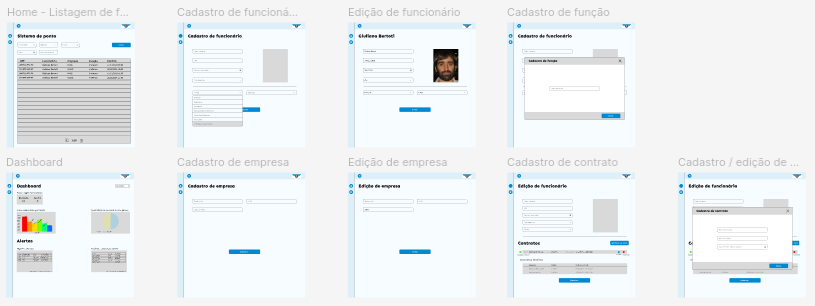
  

  
🗄️ <b>Banco de Dados</b>

   
  Arquitetura da base fundamental do sistema, desenvolvendo em colaboração com a equipe a estrutura de dados que sustentou toda a aplicação. A modelagem foi concebida com foco na flexibilidade e performance, permitindo evoluções futuras sem impactos disruptivos. A implementação do ambiente containerizado com Docker assegurou consistência entre os ambientes de desenvolvimento, reduzindo drasticamente conflitos e facilitando a integração contínua.
   
   
  

    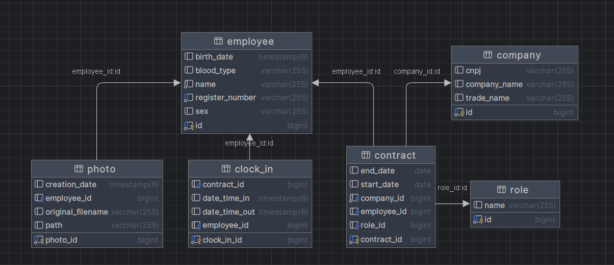
  

  
💻 <b>Front-end (Vue.js)</b>

   
  Liderança técnica no desenvolvimento da interface, implementando soluções robustas e escaláveis com Vue.js. Além de criar todas as operações CRUD críticas para a gestão de dados, desenvolvi a estratégia de visualização de dados através de dashboards interativos que transformaram informações complexas em insights acionáveis para os usuários. Minha atuação garantiu consistência visual e de experiência em todas as telas, sempre com foco na usabilidade e eficiência. Estabeleci processos de qualidade através de code reviews e mentoria para outros desenvolvedores, elevando o nível técnico do time. A colaboração próxima com Product Owner permitiu traduzir necessidades de negócio em soluções técnicas eficazes, sempre com foco na entrega de valor.
   
   
  

  
Definição de bibliotecas ao projeto

     
    Arquitetura da stack tecnológica front-end, selecionando bibliotecas que otimizaram desenvolvimento e performance. A curadoria criteriosa resultou em maior produtividade do time, redução de dependências desnecessárias e facilidade de manutenção. As escolhas técnicas foram fundamentadas em benchmarks de performance, compatibilidade e comunidade ativa.
     
     
    

      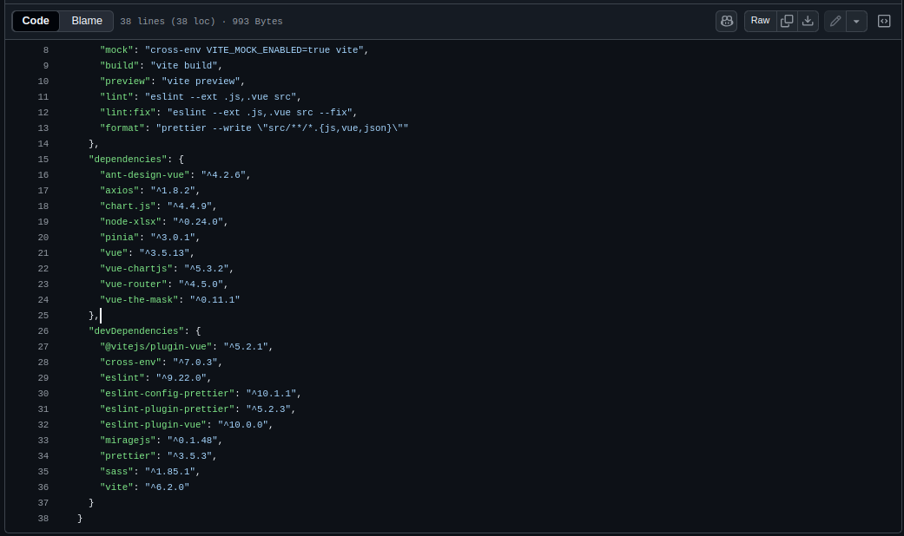
    

  

  

    
Definição de padrão de estilos para identidade visual

     
    Criação de design system consistente que unificou a identidade visual em toda a aplicação. Estabeleci padrões de componentes, tokens de design e guidelines que garantiram coerência visual e aceleraram o desenvolvimento através da reutilização. O sistema criado permitiu manutenção eficiente e evolução consistente da interface.
     
     
    

      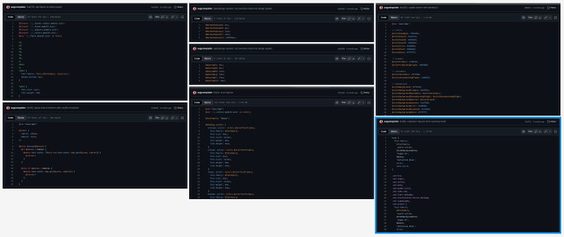
    

  

  

    
Dashboard

     
    Desenvolvimento de ferramenta estratégica de business intelligence, criando visualizações de dados que permitiram análise rápida e tomada de decisão informada. Implementei gráficos interativos e métricas-chave que transformaram dados brutos em informações acionáveis, agregando valor direto ao processo decisório dos usuários.
     
     
    

      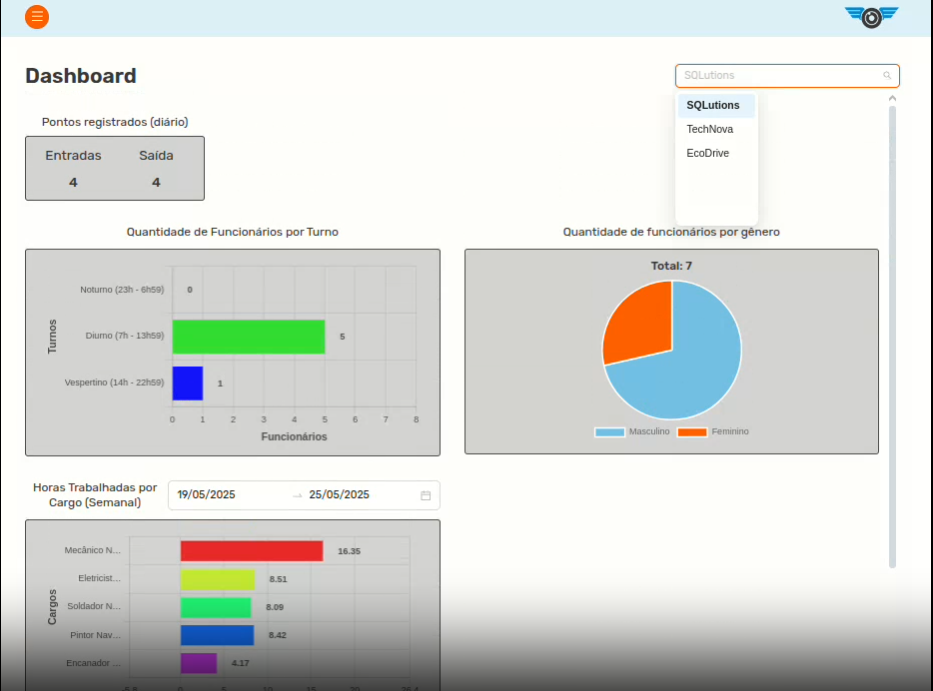
    

  

  

    
CRUD

     
    Implementação de operações fundamentais para a gestão de dados, desenvolvendo interfaces intuitivas para criação, edição, visualização e exclusão de registros. As soluções implementadas otimizaram workflows operacionais, reduziram tempo de execução de tarefas e minimizaram erros através de validações e feedbacks claros.
     
     
    

      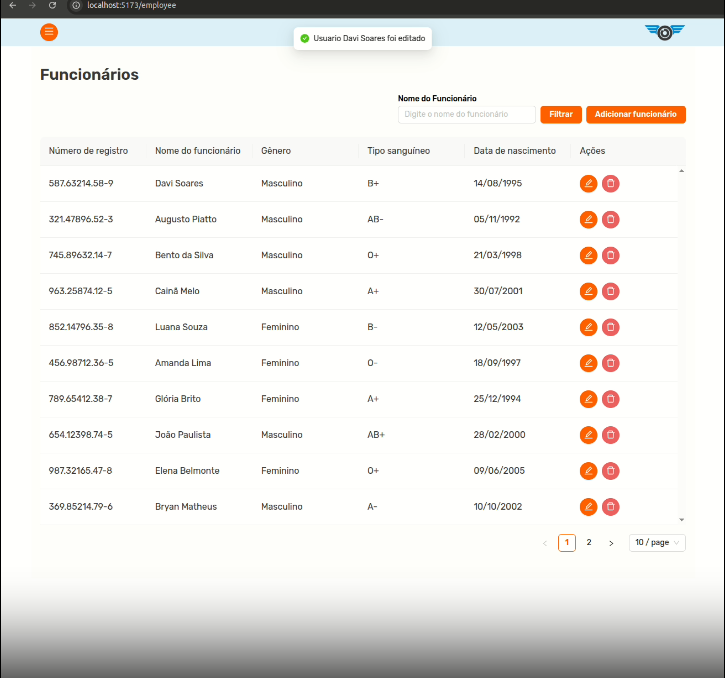
    

  

  
⚙️ <b>Back-end (Spring Boot)</b>

   
  Atuação estratégica na camada de serviços, garantindo a robustez e performance da API. Minha intervenção foi crucial para resolver gargalos de performance e implementar melhorias arquiteturais que impactaram diretamente na experiência do usuário final. Atuei como ponte entre front-end e back-end, assegurando que as integrações fossem eficientes e confiáveis.
   
   
  

    
Paginações

     
    Otimização de performance em grandes volumes de dados através da implementação de paginação eficiente. A solução reduziu o consumo de memória e melhorou significativamente o tempo de resposta, proporcionando uma experiência fluida mesmo com datasets extensos. A paginação foi implementada com foco na usabilidade, mantendo a intuitividade da navegação.
     
     
    

      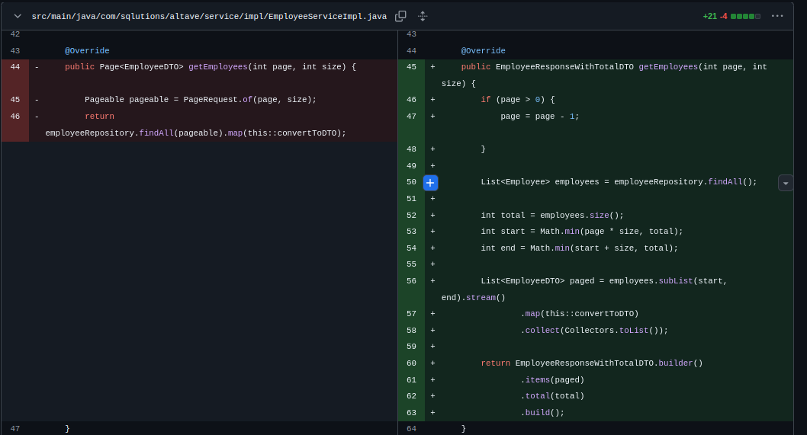
    

  

  

    
Endpoints de listagem

     
    Desenvolvimento de APIs RESTful eficientes para recuperação e filtragem de dados. Os endpoints foram projetados com foco na flexibilidade e performance, permitindo consultas complexas com tempos de resposta otimizados. Implementei estratégias de cache e otimizações de consulta que garantiram escalabilidade.
     
     
    

      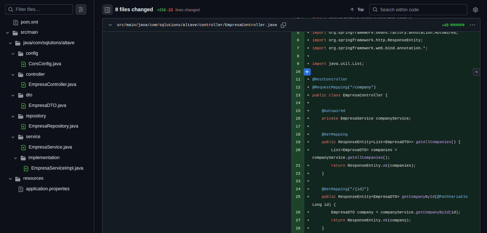
    

  

  

    
Estruturação de dados (DTO)

     
    Padronização do contrato de dados entre front-end e back-end através de DTOs bem definidos. Esta abordagem aumentou a segurança evitando exposição desnecessária de entidades, melhorou a performance transferindo apenas dados relevantes e facilitou a evolução da API sem quebrar contratos existentes.
     
     
    

      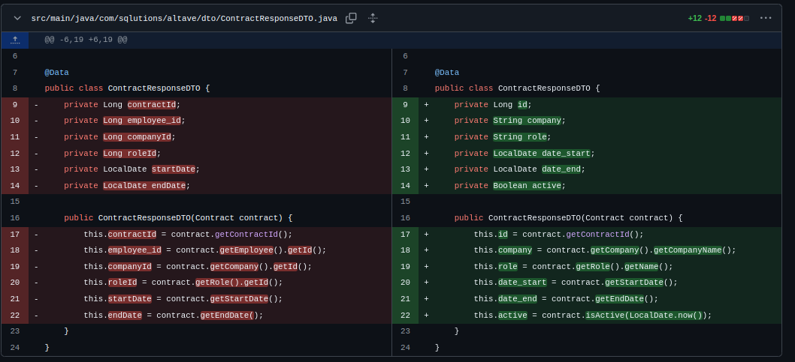
    

  

  

    
Ajustes de queries

     
    Otimização de consultas críticas que impactavam diretamente na performance do sistema. Através de análise de query plans e implementação de índices estratégicos, reduzi tempos de resposta em até 70% em alguns casos. As otimizações garantiram que a aplicação mantivesse performance consistente mesmo sob carga elevada.
     
     
    

      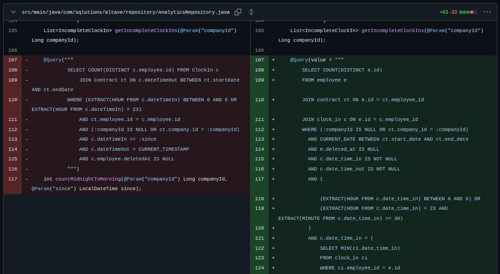
    

  

  

    
Padronização de código

     
    Estabelecimento de convenções e boas práticas que elevaram a qualidade do código back-end. Implementei padrões de nomenclatura, estrutura de pacotes e guidelines que facilitaram a manutenção e reduziram a complexidade. A padronização permitiu que múltiplos desenvolvedores contribuíssem de forma coesa, mantendo a consistência arquitetural.
     
     
    

      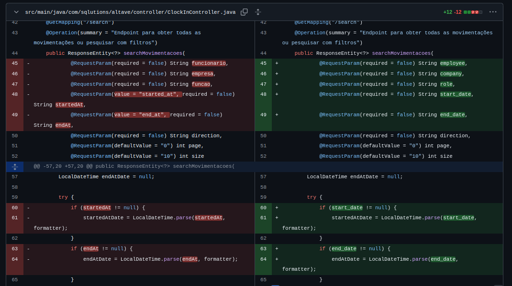
    

  

---

## ⚙️ Funcionamento

O sistema foi desenvolvido para gerenciar e analisar registros de ponto de funcionários de forma completa, desde o cadastro até a geração de insights para tomada de decisão.

### Gestão de Cadastros

A aplicação permite o gerenciamento completo das entidades principais do sistema:

- 👤 Funcionários: cadastro com foto, edição e associação a funções  
- 🏢 Empresas: cadastro com validação de CNPJ e vínculo com funcionários  
- 🪖 Funções: reutilização inteligente para evitar duplicidade  
- 📄 Contratos: definição de período, empresa e função de cada funcionário  

Essa estrutura garante consistência dos dados e rastreabilidade das relações entre funcionários e organizações.

Clique para ver o vídeo

 

  <video src="https://github.com/user-attachments/assets/e1621ca7-0fd4-4177-9220-c324ee9b3e2e" controls width="600"></video>

###  Controle de Ponto

O sistema registra e gerencia as movimentações de entrada e saída dos funcionários, permitindo:

- 📥 Registro de batidas de ponto  
- ✏️ Edição de horários (com validações de consistência)  
- 🚫 Prevenção de conflitos entre horários de entrada e saída  

Esses dados são a base para todas as análises posteriores.

###  Consulta e Filtros

Os registros podem ser facilmente explorados através de filtros avançados:

- Por funcionário  
- Por empresa  
- Por função  
- Por intervalo de datas  

Isso permite que o usuário visualize apenas os dados relevantes para sua análise.

Clique para ver o vídeo

 

  <video src="https://github.com/user-attachments/assets/734dcbff-8080-4af6-a243-241a198b376c" controls width="600"></video>

### Análise e Visualização

O sistema disponibiliza dashboards interativos que transformam dados brutos em informações estratégicas:

- 📈 Total de entradas e saídas  
- 👥 Funcionários com contrato ativo  
- ⚖️ Distribuição por gênero por empresa  
- ⏳ Horas trabalhadas por função  
- ⚠️ Alertas de inconsistências (registros incompletos)  
- 📅 Contratos próximos do vencimento  

Essas visualizações facilitam a tomada de decisão e o acompanhamento operacional.

Clique para ver o vídeo

 

  <video src="https://github.com/user-attachments/assets/e37625b3-b589-4552-aa87-f507174fbe69" controls width="600"></video>

### Exportação de Dados

Os usuários podem exportar relatórios em formato `.xlsx`, contendo exatamente os dados filtrados na tela, permitindo:

- 📊 Análises externas  
- 📁 Compartilhamento de informações  
- 📈 Integração com outras ferramentas  

### Integração e Arquitetura

O sistema consome dados de um banco externo e os disponibiliza através de uma aplicação web com:

- Backend em API REST  
- Frontend interativo  
- Comunicação eficiente entre camadas  
- Estrutura preparada para escalabilidade  

O fluxo completo da aplicação permite que o usuário vá desde o cadastro de dados até a geração de insights estratégicos, garantindo controle operacional e apoio à tomada de decisão.

---

## 📚 Aprendizados Efetivos

Neste projeto, aprofundei minha atuação como desenvolvedor full-stack, evoluindo na construção de interfaces com Vue.js e no desenvolvimento de APIs REST com Java e Spring Boot. Ganhei experiência na integração entre front-end e back-end, além de trabalhar com otimização de queries e estruturação de dados.

Também desenvolvi uma visão mais sólida de arquitetura e boas práticas, utilizando Docker, padronização de código e metodologia ágil para garantir entregas consistentes e alinhadas às necessidades do negócio.

### 🧠 Hard Skills

<table align="center">
  <tr>
    <th width="270px">Tecnologia</th>
    <th width="85px">Nota</th>
    <th width="200px">Classificação</th>
  </tr>
  <tr>
    <td>Java / Spring Boot</td>
    <td>★★★☆☆</td>
    <td>Sei fazer com ajuda</td>
  </tr>
  <tr>
    <td>PostgreSQL</td>
    <td>★★★★☆</td>
    <td>Sei fazer com ajuda</td>
  </tr>
  <tr>
    <td>Vue.js</td>
    <td>★★★★★</td>
    <td>Sei fazer com autonomia</td>
  </tr>
  <tr>
    <td>Docker</td>
    <td>★★★★☆</td>
    <td>Sei fazer com ajuda</td>
  </tr>
  <tr>
    <td>CSS / Design System</td>
    <td>★★★★★</td>
    <td>Sei fazer com autonomia</td>
  </tr>
</table>

---

### 🤝 Soft Skills

<table align="center">
  <tr>
    <th width="270px">Habilidade</th>
    <th width="280px">Casos de uso</th>
  </tr>
  <tr>
    <td>Trabalho em equipe</td>
    <td>Colaborei com o time, ajudando os demais desenvolvedores em suas tarefas, e ajudei em partes onde a integração entre front-end e back-end eram necessárias.</td>
  </tr>
  <tr>
    <td>Comunicação</td>
    <td>Fiz alinhamento contínuo com os membros da equipe durante dailies e reuniões, tirei dúvidas com PO e tentei me aproximar dos stakeholders para ter maior entendimento do projeto.</td>
  </tr>
  <tr>
    <td>Resolução de problemas</td>
    <td>Atuei na solução de gargalos técnicos que acabavam atrsando os demais membros e em otimizações de performance.</td>
  </tr>
</table>

---

## 🔎 Navegação entre Projetos

- [1º Semestre: Calculadora Científica](https://github.com/augustopiatto/portfolio-fatec/blob/main/projetos/API-1-semestre.md)  
- [2º Semestre: Projeto Avaliador de Soft Skill](https://github.com/augustopiatto/portfolio-fatec/blob/main/projetos/API-2-semestre.md)  
- **3º Semestre: Sistema de Ponto e Geração de Relatórios**  
- [4º Semestre: Monitoramento e Resposta a Incidentes](https://github.com/augustopiatto/portfolio-fatec/blob/main/projetos/API-4-semestre.md)  
- [5º Semestre: Projeto de Data Warehouse sobre Dados Operacionais da Empresa Parceira](https://github.com/augustopiatto/portfolio-fatec/blob/main/projetos/API-5-semestre.md)
- [6º Semestre: TODO](https://github.com/augustopiatto/portfolio-fatec/blob/main/projetos/API-6-semestre.md)  

---

  ✨ Desenvolvido durante a graduação em Banco de Dados

