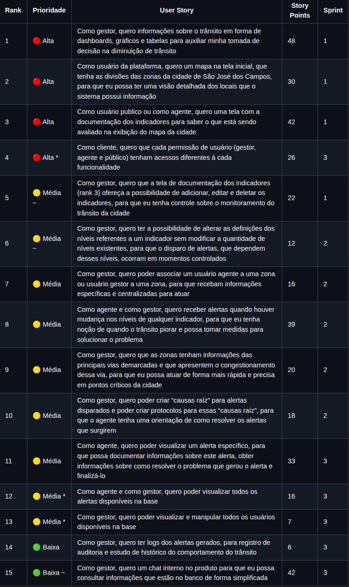
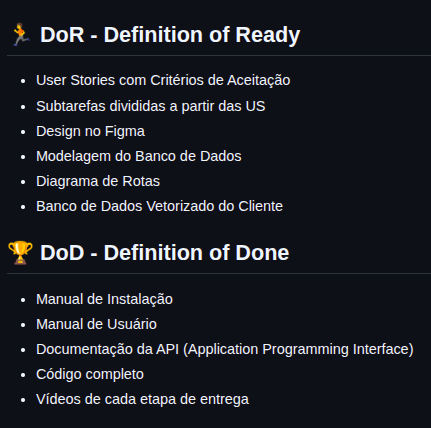
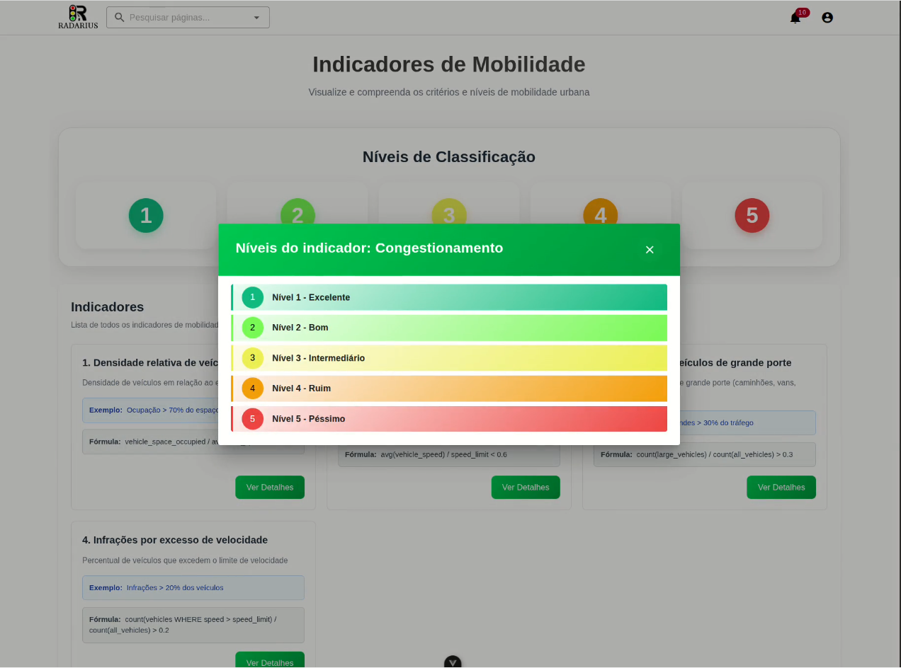
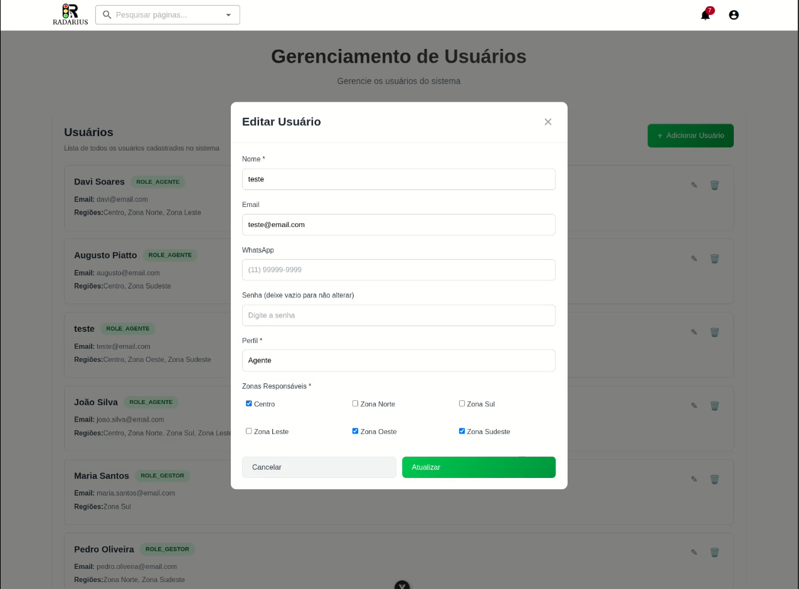
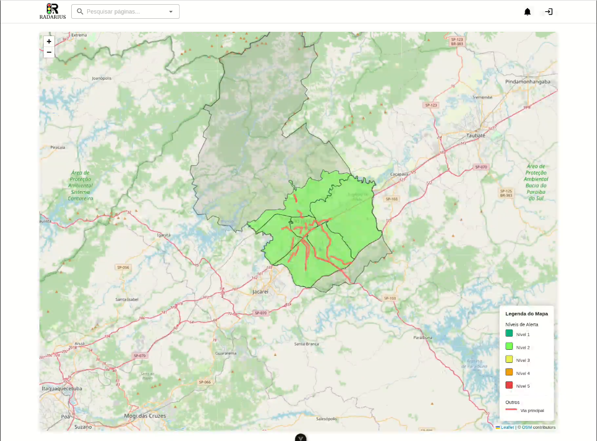

PENDENTE: TEXTO E FOTOS DA CONTRIBUIÇÃO

<h1 align="center">🚀 API 4º Semestre - 02/2025</h1>

  

  🎓 <strong>Parceiro Acadêmico:</strong> 
  FATEC São José dos Campos - Prof. Jessen Vidal   
  🤝 <strong>Empresa Parceira:</strong> 
  Prefeitura de São José dos Campos

---

## 📌 Resumo do Projeto

> Desenvolvimento de um Sistema Inteligente de Monitoramento e Alerta de Tráfego para a cidade de São José dos Campos. A solução centraliza dados de radares, permite o cadastro de indicadores personalizados com níveis de severidade e emite alertas automáticos para gestores e agentes de mobilidade. Complementado por um dashboard interativo com mapa georreferenciado, o sistema oferece visão consolidada e em tempo real dos indicadores de desempenho, padrões de tráfego e métricas dos agentes, otimizando a alocação de recursos e melhorando a fluidez do trânsito.

---

## ⚠️ Problema

> A cidade de São José dos Campos carecia de um sistema integrado que transformasse os dados dos radares em insights acionáveis para a gestão do tráfego urbano. A falta de indicadores específicos para disparo de alertas e a ausência de uma ferramenta para alocação eficiente de agentes de mobilidade resultavam em respostas tardias a incidentes e na alocação inadequada de recursos públicos.

---

## 💡 Solução

> Implementação de uma plataforma web completa com diferentes níveis de acesso (público, agente, gestor e administrador). A solução permite a definição de indicadores personalizados com níveis de severidade, emite alertas automáticos baseados nos dados dos radares, possibilita a designação inteligente de agentes por zonas e subzonas estratégicas, e oferece dashboards interativos para tomada de decisão baseada em dados. O sistema conta também com documentação de API via Swagger, logs de auditoria e protocolos para resolução de ocorrências.

---

## 🛠 Tecnologias Adotadas

  
  
  
  
  
  
  
  

- **PostgreSQL**: Banco de dados relacional utilizado para armazenar os dados de radares, indicadores, alertas, usuários e logs do sistema.
- **Docker**: Empregado para containerização da aplicação, permitindo a criação de ambientes isolados e reproduzíveis para o backend, frontend e banco de dados.
- **Java 21**: Linguagem principal do backend, com ênfase em orientação a objetos e boas práticas de desenvolvimento.
- **Spring Boot**: Framework para desenvolvimento da API RESTful, com Spring Data JPA para ORM e Spring Security para controle de autenticação e autorização por perfis.
- **Maven**: Gerenciador de dependências para automatização do build e integração de bibliotecas.
- **Vue.js**: Framework web utilizado para construir o frontend interativo, com integração de mapas georreferenciados e dashboards dinâmicos.
- **Figma**: Ferramenta de design utilizada para prototipação e validação de interface com o cliente.
- **Swagger**: Documentação interativa da API, facilitando o entendimento e teste dos endpoints.

---

## 👨‍💻 Contribuições Individuais

Atuei como **Product Owner** e **desenvolvedor full-stack** neste projeto, liderando a definição do backlog, priorização de entregas e alinhamento constante com o cliente, além de contribuir tecnicamente em diversas frentes. Minha atuação foi fundamental para garantir que o produto final atendesse às necessidades reais do negócio, mantendo o equilíbrio entre escopo, prazo e qualidade.

  
📋 <b>Gestão de Produto e Backlog</b>

   
  Como Product Owner, fui responsável por toda a gestão do backlog do produto, desde a elicitação de requisitos até a priorização das entregas. Minhas principais contribuições foram:
   
   
  

    
Definição de Prioridades e Escopo

     
    Conduzi reuniões com o cliente (Prefeitura de São José dos Campos) para entender as dores e necessidades do negócio, traduzindo-as em user stories com critérios de aceitação claros. Realizei a priorização garantindo que as funcionalidades de maior valor fossem entregues primeiro. Gerenciei mudanças de escopo ao longo do projeto, sempre alinhando com o cliente.
     
     
    

      
    

  

  

    
Definição de DoR e DoD

     
    Estabeleci critérios claros de Definition of Ready (DoR) e Definition of Done (DoD) para garantir a qualidade e previsibilidade das entregas. Os critérios incluíam subtarefas definidas, design validado no Figma, modelagem de banco de dados aprovada e documentação completa, assegurando que cada sprint entregasse valor real ao cliente.
     
     
    

      
    

  

  
📊 <b>Desenvolvimento de Funcionalidades (Back-end e Front-end)</b>

   
  Atuei no desenvolvimento de funcionalidades específicas tanto no back-end quanto no front-end do sistema, contribuindo para a lógica de negócios e para a experiência do usuário.
   
   
  

    
📈 Listar Níveis de Indicadores

     
    Implementei a lógica no back-end para listar os níveis de severidade dos indicadores de tráfego, garantindo que o front-end recebesse os dados estruturados corretamente para exibição.
     
     
    

      
    

  

  

    
📥 Lógica de Atualização do Banco com Dados CSV

     
    Desenvolvi a rotina de importação e atualização do banco de dados a partir de arquivos CSV, processando os dados dos radares e garantindo a integridade e consistência das informações armazenadas.
     
  

  

    
🔐 Criação de Níveis de Acesso do Usuário

     
    Atuei na definição e implementação dos diferentes níveis de acesso do sistema (público, agente, gestor e administrador), configurando as permissões e regras de autorização no back-end.
     
     
    

      
    

  

  

    
🗺️ Nível por Zona na Home

     
    Implementei a funcionalidade que exibe, na tela inicial, o nível de severidade de cada zona da cidade, permitindo que usuários visualizem rapidamente as condições do trânsito por região.
     
     
    

      
    

  

  
📚 <b>Documentação e Qualidade</b>

   
  Fui responsável pela criação e manutenção da documentação técnica e organizacional do projeto, garantindo que o time tivesse clareza sobre processos, regras de negócio e o funcionamento do sistema.
   
   
  

    
📘 Manual do Usuário

     
    Elaborei o <a href="https://drive.google.com/file/d/1L-FXcJWop9PP2Nl430whKPjNdSdH5czI/view">manual do usuário</a> completo, documentando todas as funcionalidades do sistema para cada perfil de acesso (público, agente, gestor e administrador), facilitando a adoção da plataforma e reduzindo a necessidade de suporte técnico.
     
  

  

    
📐 Regras de Negócio

     
    Documentei todas as <a href="https://github.com/DenariusData/API-4SEM/tree/main/docs/business-rules">regras de negócio</a> do sistema, incluindo a lógica de cálculo dos níveis de severidade, os critérios para disparo de alertas e as permissões associadas a cada nível de acesso, garantindo o alinhamento entre o time de desenvolvimento e o cliente.
     
  

  

    
🌿 Processo (Estrutura de Branchs e Padrão de Commits)

     
    Defini e documentei a <a href="https://github.com/DenariusData/API-4SEM/tree/main/docs/processo">estratégia de versionamento do projeto</a>, incluindo a estrutura de branchs (main, develop, feature/*, hotfix/*) e o padrão de commits (Conventional Commits), garantindo organização, rastreabilidade e facilitando a colaboração entre os membros da equipe.
     
  

  

    
📋 Documentação de Sprints

     
    Mantive a <a href="https://github.com/DenariusData/API-4SEM/tree/main/docs/processo/sprints">documentação completa de cada sprint</a>, incluindo planejamento, backlog entregue, retrospectivas e lições aprendidas, assegurando a transparência do progresso do projeto e servindo como registro histórico para consultas futuras.
     
  

  

    
⚙️ Documentação do Setup

     
    Elaborei a <a href="https://github.com/DenariusData/API-4SEM/tree/main/docs/setup">documentação de setup</a> do ambiente de desenvolvimento, descrevendo os pré-requisitos, dependências e passos necessários para configurar e executar o projeto localmente, facilitando a integração de novos membros ao time.
     
  

---

## ⚙️ Funcionamento

O sistema foi desenvolvido para atender quatro perfis de usuário distintos, cada um com funcionalidades e permissões específicas.

### Para o Usuário Público

O cidadão comum tem acesso a informações de utilidade pública sobre o trânsito da cidade:

- **Visualização do Mapa Interativo**: Acesso ao mapa com as zonas da cidade e seus níveis de congestionamento.
- **Documentação de Indicadores**: Consulta aos indicadores monitorados pelo sistema e seus níveis de severidade.
- **Informações Transparentes**: Dados de trânsito em linguagem acessível para a população.

Clique para ver o vídeo do fluxo do usuário público

 

### Para o Agente de Mobilidade

Os agentes de campo recebem alertas e têm ferramentas para atuar na resolução de incidentes:

- **Recebimento de Alertas**: Notificações em tempo real sobre mudanças nos níveis de severidade dos indicadores em suas zonas designadas.
- **Visualização de Alertas Específicos**: Acesso detalhado a cada alerta, com informações sobre a ocorrência e protocolos de resolução.
- **Finalização de Ocorrências**: Registro de ações realizadas e encerramento de alertas com documentação da causa raiz.

Clique para ver o vídeo do fluxo do agente

 

### Para o Gestor de Mobilidade

Os gestores possuem visibilidade estratégica e ferramentas de configuração do sistema:

- **Dashboard Interativo**: Gráficos e tabelas com indicadores de desempenho, padrões de tráfego e métricas dos agentes.
- **Configuração de Indicadores**: Criação e edição de indicadores personalizados com níveis de severidade.
- **Gestão de Alertas**: Visualização de todos os alertas gerados e análise de logs históricos.
- **Designação de Agentes**: Associação de agentes a zonas e subzonas para alocação eficiente de recursos.
- **Criação de Protocolos**: Definição de causas raiz e protocolos de ação para orientar os agentes.

Clique para ver o vídeo do fluxo do gestor

 

  <video src="../assets/projeto-4/videos/fluxo-gestor.mp4" alt="Fluxo gestor" controls width="600"></video>

### Para o Administrador

O administrador tem controle total sobre o sistema e seus usuários:

- **Gestão Completa de Usuários**: Criação, edição, exclusão e gerenciamento de perfis de todos os usuários da plataforma.
- **Configurações Globais**: Acesso a todas as configurações do sistema.
- **Auditoria**: Acesso a logs completos para rastreamento de ações e histórico.

Clique para ver o vídeo do fluxo do administrador

 

  <video src="../assets/projeto-4/videos/fluxo-admin.mp4" alt="Fluxo admin" controls width="600"></video>

---

## 📚 Aprendizados Efetivos

Este projeto representou um marco importante na minha formação, sendo minha primeira experiência como Product Owner em um projeto real com cliente corporativo. Aprendi a equilibrar as demandas do negócio com as limitações técnicas e de prazo da equipe, desenvolvendo habilidades valiosas de liderança, comunicação e gestão de expectativas.

### 🧠 Hard Skills

<table align="center">
   <tr>
    <th width="270px">Tecnologia/Metodologia</th>
    <th width="85px">Nota</th>
    <th width="200px">Classificação</th>
   </tr>
   <tr>
    <td>Gestão de Produto (Product Owner)</td>
    <td>★★★★★</td>
    <td>Sei fazer com autonomia</td>
   </tr>
   <tr>
    <td>Spring Boot / Spring Security</td>
    <td>★★★★☆</td>
    <td>Sei fazer com ajuda</td>
   </tr>
   <tr>
    <td>Vue.js</td>
    <td>★★★★★</td>
    <td>Sei fazer com autonomia</td>
   </tr>
   <tr>
    <td>PostgreSQL</td>
    <td>★★★★★</td>
    <td>Sei fazer com autonomia</td>
   </tr>
   <tr>
    <td>Docker</td>
    <td>★★★★☆</td>
    <td>Sei fazer com ajuda</td>
   </tr>
   <tr>
    <td>Swagger/OpenAPI</td>
    <td>★★★★★</td>
    <td>Sei fazer com autonomia</td>
   </tr>
   <tr>
    <td>Metodologia Ágil Scrum</td>
    <td>★★★★★</td>
    <td>Sei fazer com autonomia</td>
   </tr>
</table>

---

### 🤝 Soft Skills

<table align="center">
   <tr>
    <th width="270px">Habilidade</th>
    <th width="280px">Descrição</th>
   </tr>
   <tr>
    <td>Liderança e Gestão de Equipe</td>
    <td>Atuei como Product Owner, conduzindo refinamentos e mantendo o time alinhado e motivado durante todo o projeto.</td>
   </tr>
   <tr>
    <td>Comunicação com Stakeholders</td>
    <td>Realizei conversas constantes com o cliente "Prefeitura de São José dos Campos" via Slack, para alinhar expectativas, apresentar entregas e gerenciar mudanças de escopo de forma transparente.</td>
   </tr>
   <tr>
    <td>Priorização e Gestão de Escopo</td>
    <td>Gerenciei a remoção de 70 horas em user stories e a inclusão de 49 horas de novas histórias, garantindo entregas de valor dentro do prazo estabelecido.</td>
   </tr>
   <tr>
    <td>Planejamento Estratégico</td>
    <td>Defini a visão do produto, estabeleci critérios de DoR e DoD, e planejei as sprints considerando riscos, dependências e capacidade da equipe.</td>
   </tr>
</table>

---

## 🔎 Navegação entre Projetos

- [1º Semestre: Calculadora Científica](https://github.com/augustopiatto/portfolio-fatec/blob/main/projetos/API-1-semestre.md)
- [2º Semestre: Projeto Avaliador de Soft Skill](https://github.com/augustopiatto/portfolio-fatec/blob/main/projetos/API-2-semestre.md)
- [3º Semestre: Sistema de Ponto e Geração de Relatórios](https://github.com/augustopiatto/portfolio-fatec/blob/main/projetos/API-3-semestre.md)
- **4º Semestre: Monitoramento e Resposta a Incidentes**
- [5º Semestre: TODO](https://github.com/augustopiatto/portfolio-fatec/blob/main/projetos/API-5-semestre.md)
- [6º Semestre: TODO](https://github.com/augustopiatto/portfolio-fatec/blob/main/projetos/API-6-semestre.md)

---

  ✨ Desenvolvido durante a graduação em Banco de Dados

