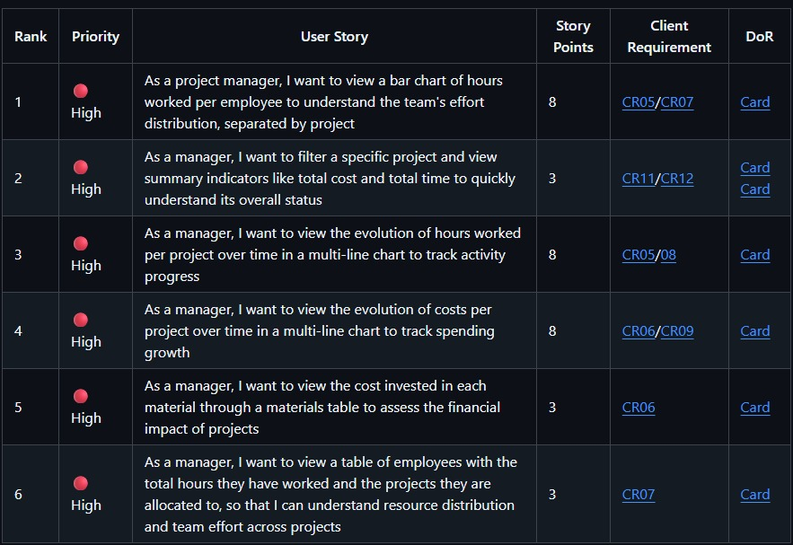
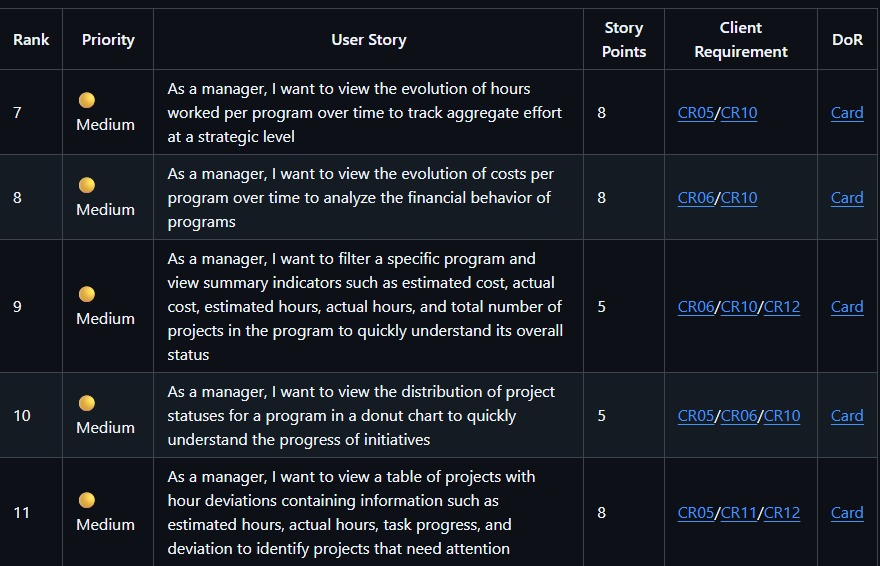
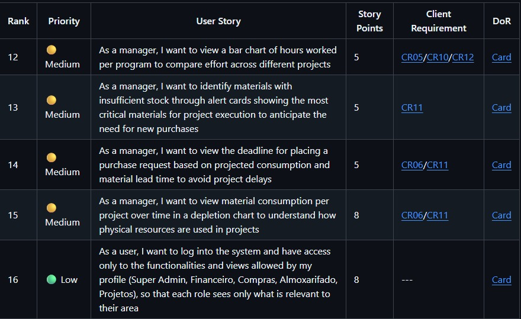
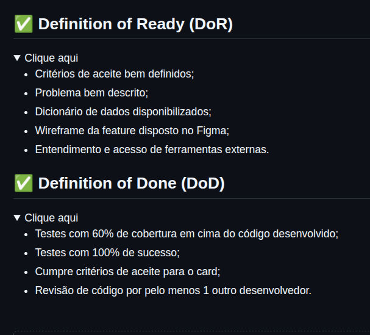
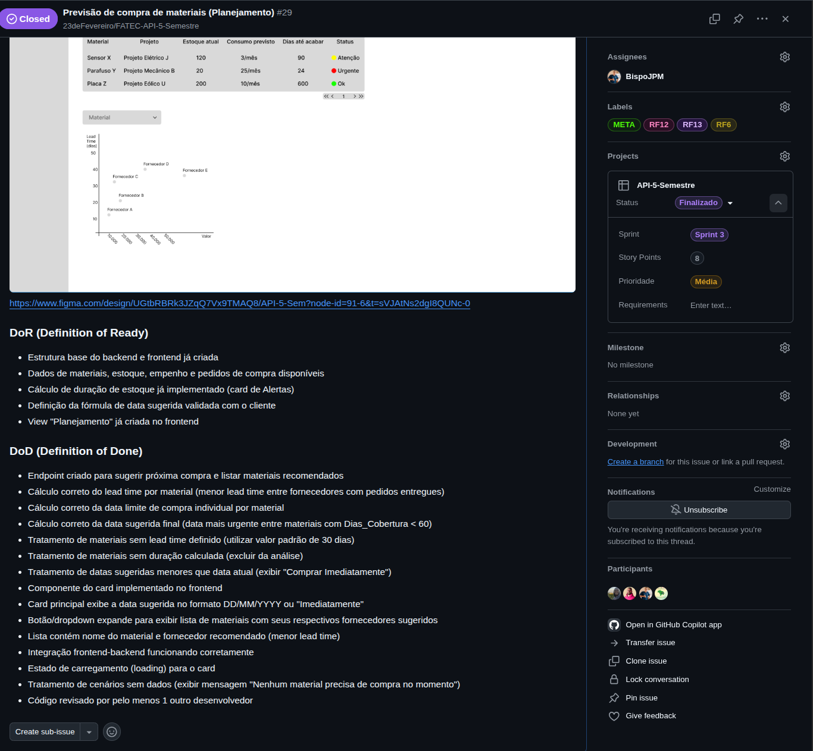
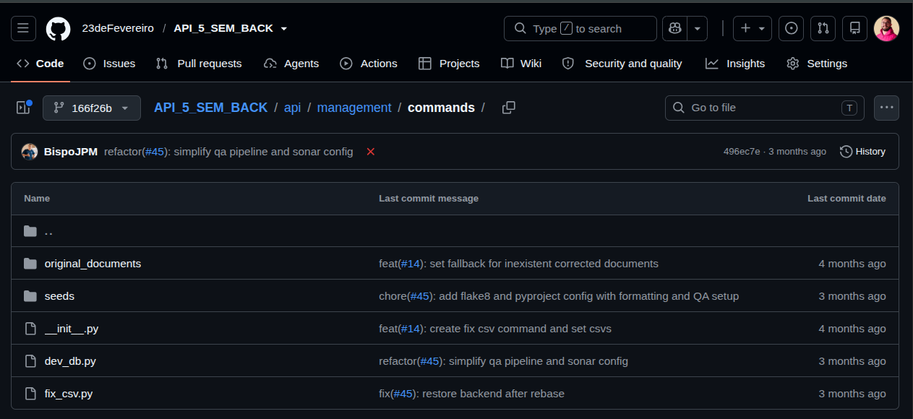

<h1 align="center">🚀 API 5º Semestre - 01/2026</h1>

  

  🎓 <strong>Parceiro Acadêmico:</strong> 
  FATEC São José dos Campos - Prof. Jessen Vidal   
  🤝 <strong>Empresa Parceira:</strong> 
  SIATT - Sistemas Integrados de Alto Teor Tecnológico

---

## 📌 Resumo do Projeto

> Desenvolvimento da plataforma analítica Lunae para a SIATT – Sistemas Integrados de Alto Teor Tecnológico. A solução integra dados dispersos de projetos, programas, compras, tarefas e horas trabalhadas, consolidando informações atualmente fragmentadas em diferentes sistemas e tabelas. Por meio da importação de arquivos CSV, os dados são processados, tratados e armazenados em uma base estruturada, permitindo consultas analíticas precisas. Complementado por um dashboard interativo com gráficos de barras e linhas, a ferramenta oferece visão consolidada e multidimensional do consumo de recursos, evolução de custos e esforço técnico por projeto e programa, apoiando a gestão estratégica e a tomada de decisão.

---

## ⚠️ Problema

> A SIATT não possuía uma visão integrada das informações relacionadas a pedidos de compras, ordens, compromissos de materiais, controle de estoque, tarefas de desenvolvimento e horas trabalhadas, que estavam distribuídas em diferentes tabelas e sistemas. A ausência de integração dificultava a análise do custo real dos projetos, a comparação entre programas institucionais e o acompanhamento do consumo de materiais e horas técnicas ao longo do tempo. Gestores e responsáveis pelo acompanhamento financeiro enfrentavam dificuldades para responder perguntas essenciais, como o custo total por projeto em materiais, o valor despendido em horas técnicas e o custo real do produto considerando materiais e esforço de desenvolvimento.

---

## 💡 Solução

> Implementação de uma plataforma analítica completa que integra dados das áreas de projetos, compras e desenvolvimento, estruturados para apoiar análises históricas e estratégicas. A solução permite a importação de arquivos CSV fornecidos pela parceira, com processamento e tratamento dos dados para armazenamento em banco de dados estruturado. O sistema disponibiliza um dashboard interativo com gráficos de barras e linhas, permitindo que gestores acompanhem o consumo de recursos, a evolução dos custos e o esforço técnico por projeto e programa, além de aplicar filtros para explorar diferentes cenários. Construído de forma colaborativa com a equipe da SIATT por meio de interações via Slack, seguindo metodologia ágil incremental, o Lunae oferece uma visão multidimensional que viabiliza a geração de indicadores relevantes para a gestão de programas e projetos estratégicos da empresa.

---

## 🛠 Tecnologias Adotadas

  
  
  
  
  
  
  
  
  

- **Vue.js**: Framework web utilizado para construir o frontend interativo, com integração de mapas georreferenciados e dashboards dinâmicos.
- **Django**: Framework web em Python utilizado no backend para desenvolvimento da API RESTful, com sua arquitetura MVT (Model-View-Template) e ORM integrado, responsável pelo processamento dos dados importados via CSV, tratamento e armazenamento no banco de dados, além de gerenciar as requisições e lógica de negócio da plataforma.
- **PostgreSQL**: Banco de dados relacional utilizado para armazenar os dados de programas, projetos e tarefas.
- **Figma**: Ferramenta de design utilizada para prototipação e validação de interface com o cliente.
- **Git**: Sistema de controle de versionamento distribuído utilizado para gerenciar o código-fonte do projeto, permitindo o rastreamento de alterações, trabalho em paralelo por meio de branches e colaboração eficiente entre os membros da equipe.
- **Slack**: Ferramenta de comunicação utilizada para interação contínua com a equipe da SIATT, facilitando o alinhamento de requisitos, esclarecimento de dúvidas sobre regras de negócio, definição de métricas e consolidação de critérios ao longo do desenvolvimento incremental.
- **VsCode**: Editor de código-fonte utilizado pela equipe de desenvolvimento para codificação do frontend e backend, com suporte a extensões para Vue.js, Python, Django, integração com Git e depuração, aumentando a produtividade durante a implementação da solução.
- **GitHub**: Plataforma de hospedagem de repositórios Git utilizada para armazenar o código-fonte do projeto, gerenciar issues, pull requests e revisões de código, além de possibilitar a integração contínua e o acompanhamento do progresso da equipe.
- **Swagger**: Documentação interativa da API, facilitando o entendimento e teste dos endpoints.

---

## 👨‍💻 Contribuições Individuais

Atuei como **Product Owner** e **membro do time de DevOps** neste projeto, liderando a definição do backlog, priorização de entregas e alinhamento constante com o cliente, além de contribuir com o versionamento do banco. Minha atuação foi fundamental para garantir que o produto final atendesse às necessidades reais do negócio, mantendo o equilíbrio entre escopo, prazo e qualidade.

  
📋 <b>Gestão de Produto e Backlog</b>

   
  Como Product Owner, fui responsável por toda a gestão do backlog do produto, desde a elicitação de requisitos até a priorização das entregas. Minhas principais contribuições foram:
   
   
  

    
Definição de Prioridades e Escopo

     
    Conduzi reuniões com o cliente (SIATT) para entender as dores e necessidades do negócio, traduzindo-as em user stories com critérios de aceitação claros. Realizei a priorização garantindo que as funcionalidades de maior valor fossem entregues primeiro. Gerenciei mudanças de escopo ao longo do projeto, sempre alinhando com o cliente.
     
     
    

      
      
      
    

  

  

    
Definição de DoR e DoD

     
    Estabeleci critérios claros de Definition of Ready (DoR) e Definition of Done (DoD) para o projeto e por card para garantir a qualidade e previsibilidade das entregas. Os critérios incluíam subtarefas definidas, design validado no Figma, modelagem de banco de dados aprovada e documentação completa, assegurando que cada sprint entregasse valor real ao cliente.
     
     
    

      
    

    

      
    

  

  
📊 <b>Atuação no time de DevOps</b>

   
  Atuei no desenvolvimento de versionamento e rastreabilidade de histórico do banco de dados do projeto, garantindo que alterações necessárias no banco pudessem ser rastreadas através de "versões" (a pasta "seeds" da imagem) e, caso necessário algum rollback na plataforma, que a versão do banco acompanhasse a versão do código, mantendo o funcionamento estável para o usuário.

   

  [Acesso à documentação do Banco de Dados](https://github.com/23deFevereiro/FATEC-API-5-Semestre/wiki/12.-DevOps#%EF%B8%8F-database)

  [Acesso ao comandos de DevOps do Banco de Dados](https://github.com/23deFevereiro/API_5_SEM_BACK/tree/main/api/management/commands)

  

    
  

  
📚 <b>Documentação e Qualidade</b>

   
  Fui responsável pela criação e manutenção de parte da documentação técnica e organizacional do projeto, garantindo que o time tivesse clareza sobre processos, regras de negócio e o funcionamento do sistema.
   
   
  

    
📐 Regras de Negócio

     
    Documentei todas as <a href="https://github.com/23deFevereiro/FATEC-API-5-Semestre/wiki/3.-Documenta%C3%A7%C3%A3o-de-Produto">regras de negócio</a> do sistema, incluindo as principais funcionalidades do sistema e a lógica de cálculos utilizados, garantindo o alinhamento entre o time de desenvolvimento e o cliente.
     
  

  

    
🌿 Processo (Estrutura de Branchs e Padrão de Commits)

     
    Defini e documentei a <a href="https://github.com/23deFevereiro/FATEC-API-5-Semestre/wiki/2.-Padr%C3%B5es-de-Desenvolvimento#-estrat%C3%A9gia-de-branch">estratégia de versionamento do projeto</a>, incluindo a estrutura de branchs (main, develop, feature/*, hotfix/*) e o padrão de commits (Conventional Commits), garantindo organização, rastreabilidade e facilitando a colaboração entre os membros da equipe.
     
  

  

    
🧪 Testes

     
    Defini e documentei a <a href="https://github.com/23deFevereiro/FATEC-API-5-Semestre/wiki/2.-Padr%C3%B5es-de-Desenvolvimento#-testes">estratégia de testes do projeto</a>, definindo um padrão sobre os testes do time (testes que não englobam o escopo de DevOps), com exemplos e documentação.
     
  

  

    
👀 Code Review

     
    Defini e documentei a <a href="https://github.com/23deFevereiro/FATEC-API-5-Semestre/wiki/2.-Padr%C3%B5es-de-Desenvolvimento#-code-review">estratégia de revisão de código do projeto</a>, definindo as melhores práticas para se avaliar com qualidade o desenvolvimento de código do projeto.
     
  

  

    
📋 Documentação de Sprints

     
    Mantive a <a href="https://github.com/23deFevereiro/FATEC-API-5-Semestre/wiki/4.-Documenta%C3%A7%C3%A3o-das-Sprints">documentação parcial de cada sprint</a>, incluindo desafio enfrentado, backlog entregue e associação aos cards, servindo como registro histórico para consultas futuras.
     
  

---

## ⚙️ Funcionamento

A plataforma Lunae foi desenvolvida para atender diferentes níveis de análise dentro da SIATT, organizados em três funcionalidades que contemplam visões operacional, tática e preditiva da gestão de projetos e programas.

### Visão de Projetos

Nesta visão, o usuário tem acesso a uma visão detalhada e operacional de cada projeto individualmente.
O usuário pode selecionar um projeto específico por meio de um seletor (busca por código/nome) e visualizar:

- **Cards de Resumo do Projeto**: Exibem o Custo Total (soma de horas e materiais) e o Tempo Total (soma de todas as horas apontadas) do projeto selecionado.
- **Tabela de Materiais do Projeto**: Lista os materiais consumidos no projeto com suas quantidades empenhadas e o custo calculado pela multiplicação da quantidade pelo custo estimado.
- **Gráficos Burnup**: Apresentam a evolução temporal do acúmulo de horas e de custos ao longo do tempo, com cada linha representando um projeto para comparação de progresso.
- **Gráfico de Barra - Horas por Funcionário**: Distribui as horas trabalhadas entre os funcionários alocados no projeto, permitindo visualizar a carga de trabalho individual.
- **Tabela de Funcionários do Projeto**: Relaciona os colaboradores alocados, com suas horas dedicadas ao projeto e a lista de outros projetos em que atuam simultaneamente.

Clique para ver o vídeo do fluxo da visão de projetos

 

  <video src="" controls width="600"></video>

### Visão de Programas

Nesta fase, o usuário obtém uma visão consolidada e comparativa entre os programas institucionais da SIATT.
O usuário pode selecionar um programa específico por meio de um seletor e visualizar:

- **Cards de Resumo do Programa**: Consolidam os principais indicadores do programa, incluindo Custo Estimado, Custo Real, Horas Estimadas, Horas Reais e Total de Projetos vinculados.
- **Gráficos Burnup - Programa**: Compara a evolução de horas e custos entre diferentes programas, com cada linha representando um programa distinto.
- **Tabela de Projetos com Desvio de Hora**: Exibe o desempenho de cada projeto com indicadores de desvio entre horas realizadas e estimadas, sugerindo ações como manter funcionamento, monitorar ou revisar urgentemente conforme o percentual de desvio.
- **Gráfico de Barra - Horas por Projeto**: Mostra a distribuição de horas trabalhadas entre os projetos do programa selecionado.
- **Gráfico de Rosca - Status dos Projetos**: Apresenta a distribuição percentual dos projetos por status (Concluído, Planejamento, Em andamento ou Suspenso).

Clique para ver o vídeo do fluxo da visão de programas

 

  <video src="" controls width="600"></video>

### Visão de planejamento

Nesta fase, o usuário obtém insights preditivos para antecipar necessidades de materiais e otimizar a gestão de estoques e compras.
O usuário tem acesso a ferramentas de planejamento e alerta para gestão de materiais:

- **Alertas de Materiais**: Identifica e destaca os materiais críticos e aqueles em atenção com base na relação entre dias de cobertura e lead time de cada item.
- **Previsão de Próxima Compra**: Recomenda a data ideal para novos pedidos e agrupa os materiais necessários por janelas de urgência (comprar agora, em 8-15 dias ou em 16-30 dias).
- **Tabela de Materiais com Risco de Falta**: Apresenta uma relação detalhada e ordenável de itens com indicadores como estoque atual, pedidos pendentes, consumo diário e status classificado como Urgente, Atenção ou OK.
- **Gráfico de Dispersão - Lead Time por Fornecedor**: Compara fornecedores para um material específico relacionando lead time e valor total do pedido, com cores por status e destaque para o fornecedor de menor prazo.

Clique para ver o vídeo do fluxo da visão de planejamento

 

  <video src="" controls width="600"></video>

### Funcionalidades transversais

A plataforma conta com recursos aplicáveis a todas as visões:

- **Filtros Globais**: Permitem refinar as análises por período, status do projeto, fornecedor e material conforme a necessidade de cada visualização.
- **Exportação de Dados**: Possibilita o compartilhamento de análises nos formatos CSV, Excel e PDF com outras áreas da SIATT.

---

## 📚 Aprendizados Efetivos

Este projeto foi me permitiu atuar como Product Owner em um ambiente corporativo real, com a parceira SIATT, aprofundando meus conhecimentos em projetos de data warehouse e business intelligence. Aprimorei a habilidade de traduzir as necessidades estratégicas da empresa em funcionalidades concretas, priorizando entregas que gerassem valor real para os gestores em diferentes níveis (operacional, tático e preditivo). Desenvolvi e melhorei habilidades importantes na gestão de escopo, equilibrando as demandas do cliente com a capacidade da equipe e os desafios técnicos relacionados à integração e consistência dos dados.

### 🧠 Hard Skills

<table align="center">
    <tr>
      <th width="270px">Tecnologia/Metodologia</th>
      <th width="85px">Nota</th>
      <th width="200px">Classificação</th>
    </tr>
   <tr>
    <td>Gestão de Produto (Product Owner)</td>
    <td>★★★★★</td>
    <td>Sei fazer com autonomia</td>
   </tr>
   <tr>
    <td>Vue.js</td>
    <td>★★★★★</td>
    <td>Sei fazer com autonomia</td>
   </tr>
   <tr>
    <td>Django</td>
    <td>★★★★★</td>
    <td>Sei fazer com autonomia</td>
   </tr>
   <tr>
    <td>PostgreSQL</td>
    <td>★★★★★</td>
    <td>Sei fazer com autonomia</td>
   </tr>
   <tr>
    <td>Figma</td>
    <td>★★★★★</td>
    <td>Sei fazer com autonomia</td>
   </tr>
   <tr>
    <td>Git</td>
    <td>★★★★★</td>
    <td>Sei fazer com autonomia</td>
   </tr>
   <tr>
    <td>Swagger</td>
    <td>★★★★★</td>
    <td>Sei fazer com autonomia</td>
   </tr>
</table>

---

### 🤝 Soft Skills
  
<table align="center">
    <tr>
      <th width="270px">Habilidade</th>
      <th width="280px">Descrição</th>
    </tr>
    <tr>
      <td>Liderança e Gestão de Equipe</td>
      <td>Atuei como Product Owner, conduzindo refinamentos e mantendo o time alinhado e motivado durante todo o projeto.</td>
    </tr>
    <tr>
      <td>Comunicação com Stakeholders</td>
      <td>Realizei conversas constantes com o cliente "SIATT" via Slack, para alinhar expectativas, apresentar entregas e gerenciar mudanças de escopo de forma transparente.</td>
    </tr>
    <tr>
      <td>Priorização e Gestão de Escopo</td>
      <td>Conduzi a priorização das funcionalidades ao longo das três sprints, equilibrando as demandas do parceiro com a capacidade da equipe, removendo tarefas de baixo valor de entrega e adiando ou adiantando entregas para outras sprints.</td>
    </tr>
	<tr>
      <td>Planejamento Estratégico</td>
      <td>Defini a visão do produto, estabeleci critérios de DoR e DoD, e planejei as sprints considerando riscos, dependências e capacidade da equipe.</td>
    </tr>
	<tr>
      <td>Orientação a Resultados</td>
      <td>Mantive o foco na entrega de valor tangível para o cliente, assegurando que cada sprint resultasse em funcionalidades prontas para uso e que os dashboards gerassem insights aplicáveis à gestão da SIATT.</td>
    </tr>
</table>

---

## 🔎 Navegação entre Projetos

- [1º Semestre: Calculadora Científica](https://github.com/augustopiatto/portfolio-fatec/blob/main/projetos/API-1-semestre.md)
- [2º Semestre: Projeto Avaliador de Soft Skill](https://github.com/augustopiatto/portfolio-fatec/blob/main/projetos/API-2-semestre.md)
- [3º Semestre: Sistema de Ponto e Geração de Relatórios](https://github.com/augustopiatto/portfolio-fatec/blob/main/projetos/API-3-semestre.md)  
- [4º Semestre: Radarius - Monitoramento e Resposta a Incidentes](https://github.com/augustopiatto/portfolio-fatec/blob/main/projetos/API-4-semestre.md)
- **5º Semestre:** Projeto de Data Warehouse sobre Dados Operacionais da Empresa Parceira
- [6º Semestre: TODO](https://github.com/augustopiatto/portfolio-fatec/blob/main/projetos/API-6-semestre.md)  

---

  ✨ Desenvolvido durante a graduação em Banco de Dados

